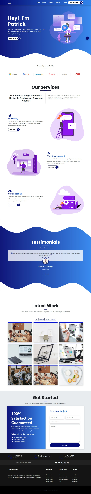

<h1 align="center">Portfolio - Ramon Meira</h1>

> This project is a website to display my portfolio, i.e., some of the work I have been developing.

<div align="center">

[](https://forthebadge.com)
[](https://forthebadge.com)

[](https://forthebadge.com)

</div>

## WEBSITE PREVIEW

[GitHub Page](ramonmeira.github.io/portfolio)

### SCREENSHOT



<!-- ## 🛠 Instalação

```sh
 npm i
 npm run compile:sass
``` -->

## Versioning ([SemVer](http://semver.org/))

-   0.4.0
    -   Update: Companies section
-   0.3.0
    -   Update: Intro section
-   0.2.0
    -   Update: navbar
    -   Remove: FAQ section
-   0.1.0
    -   Update: initial personalization
        -   CSS
        -   Logo
-   0.0.0
    -   Forked from [MuriungiPatrick/Bootstrap-5-portfolio-template](https://github.com/MuriungiPatrick/Bootstrap-5-portfolio-template)

## Backlog

-   Update: Services section
-   Update: testimonial section
-   Update: portfolio section
-   Update: Get started section
-   Update: Footer
-   Feature: intro animation

## Acknowledgments

-   [MuriungiPatrick](https://github.com/MuriungiPatrick) for the initial template.
    -   Checkout the [freeCodeCamp](https://www.freecodecamp.org/news/learn-bootstrap-5-and-sass-by-building-a-portfolio-website/) tutorial

## License

[ISC License (ISC)](https://opensource.org/licenses/ISC)
